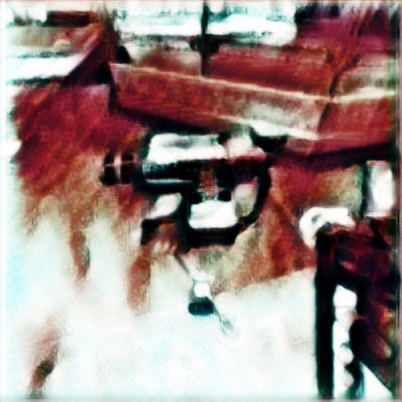

# [NS2 Combat Equipment](https://steamcommunity.com/sharedfiles/filedetails/?id=2230489630 "Link to Steam Workshop")

[Natural Selection 2 on Steam](https://steamcommunity.com/app/4920 "Steam Community :: Natural Selection 2")




Compatible with [NS2Combat](https://steamcommunity.com/sharedfiles/filedetails/?id=1383137960) and vanilla. Same prices and research time as the shotgun.

# Vanilla
Commander can research personal sentries. Only one sentry per player

# Combat mod
Upgrade for one sentry. Requires armor 2 and a welder to build.

- range is increased by 50%
- fov increased from 160° to 180°
- halved damage from gorge bile and lerk spikes

---
```
ModID: 84F2921E
```
[Source on Github](https://github.com/ailmanki/NS2_CombatEquipment)

Code and ideas reused from the following mods, with most coming from Last Stand:
- [Hades Device](https://steamcommunity.com/sharedfiles/filedetails/?id=873978863)
- [Last Stand](https://steamcommunity.com/sharedfiles/filedetails/?id=635568146)
- [Personal Shield Gnenerator](https://steamcommunity.com/sharedfiles/filedetails/?id=1173477213)
- [Weapon Switch Improvements](https://steamcommunity.com/sharedfiles/filedetails/?id=1218273658)


Thanks to Rusty for inspiring me!
